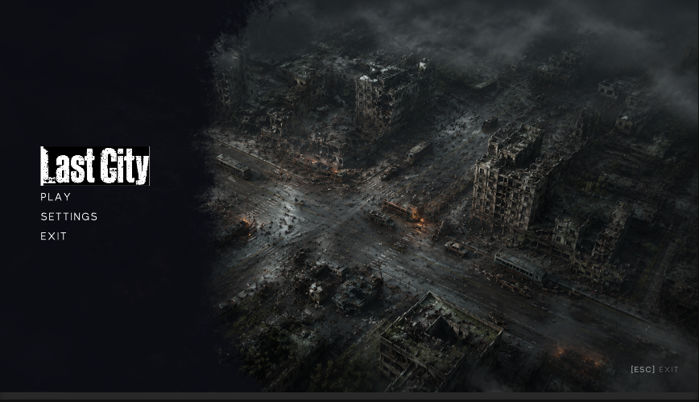
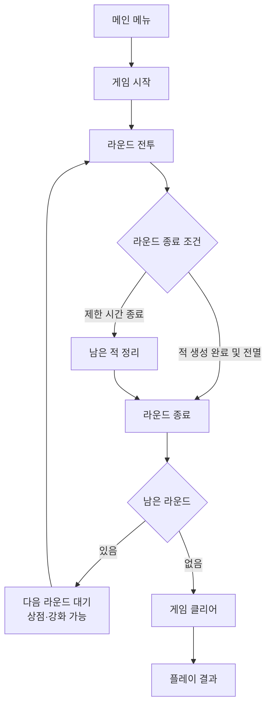
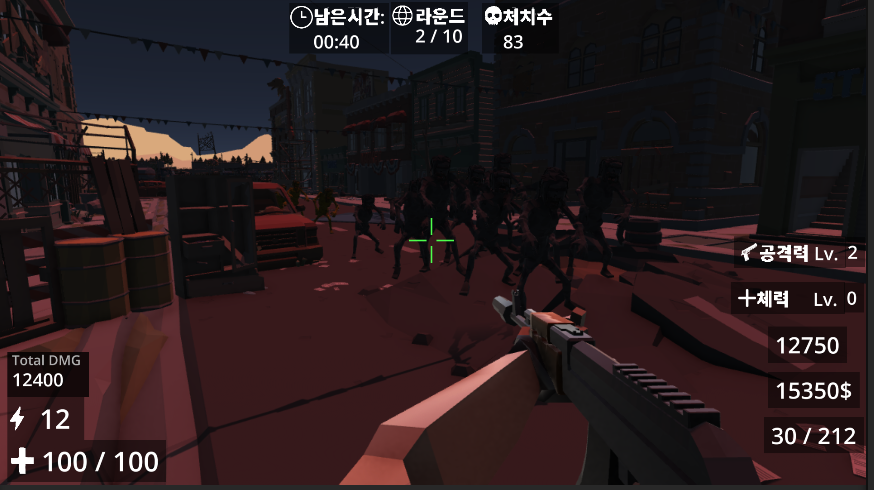
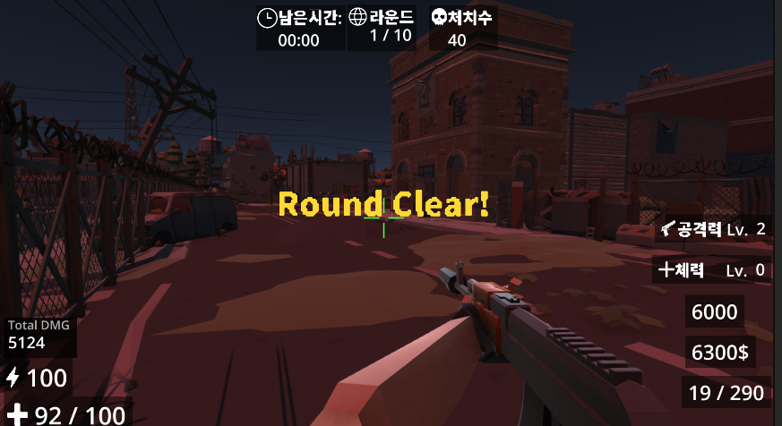
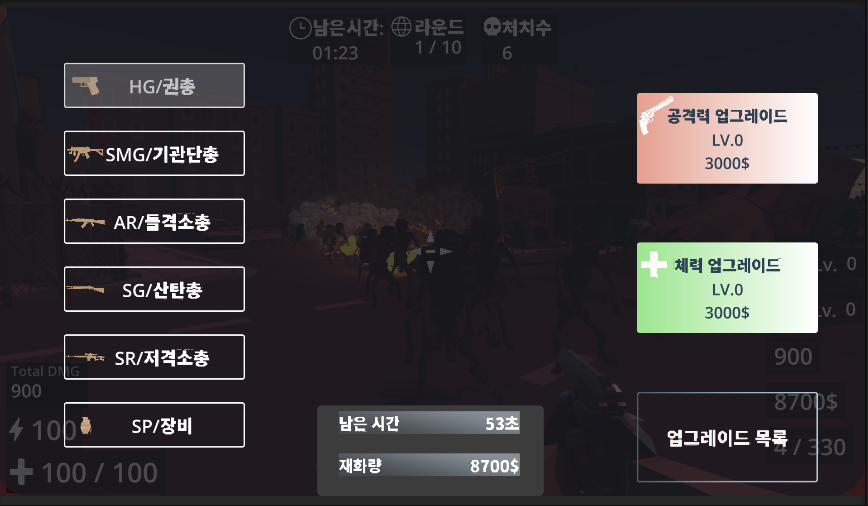
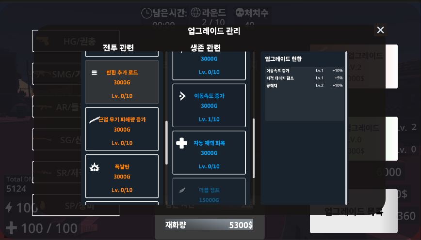
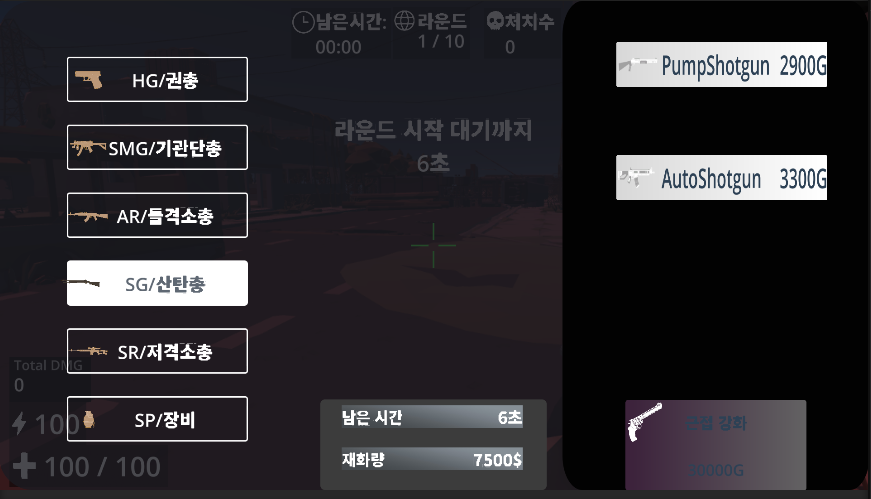
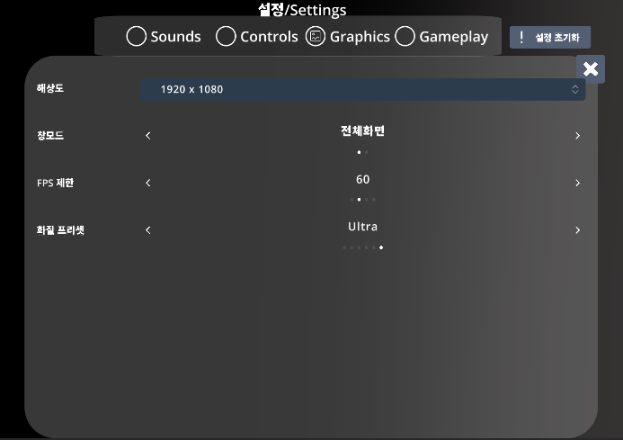
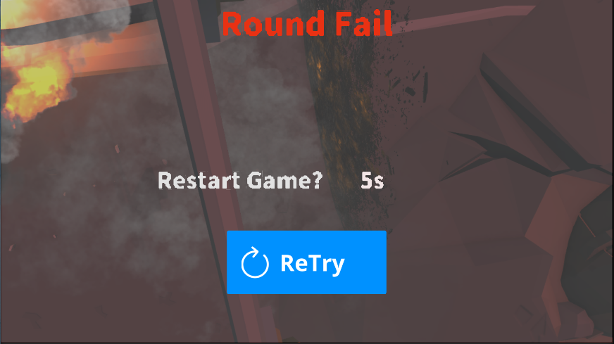
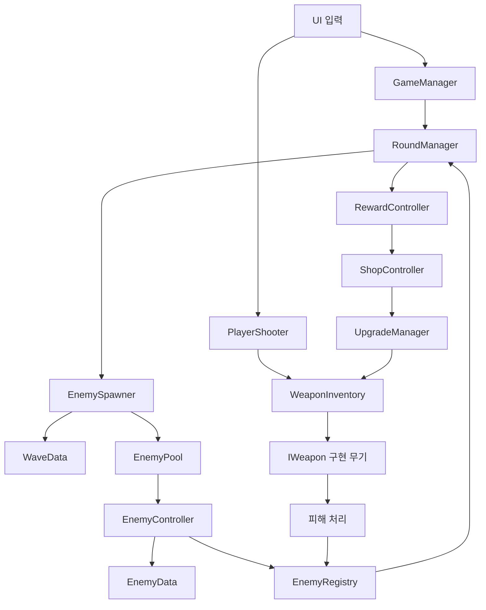

# Last City — 1인칭 라운드제 서바이벌 슈팅

<p align="center">
  
</p>

> 제한 시간 동안 적의 공격에서 생존하고, 획득한 재화로 무기와 능력을 강화해 마지막까지 생존하는 서바이벌.

## 게임 소개

| 항목        | 내용                                              |
| ----------- | ------------------------------------------------- |
| 장르        | 1인칭 라운드제 서바이벌 슈팅                      |
| 목표        | 라운드 제한 시간 동안 생존하고 모든 라운드를 완료 |
| 핵심 흐름   | 전투 → 보상 획득 → 상점 강화 → 다음 라운드        |
| 플레이 방식 | 총기·근접 무기·투척 무기를 교체하며 적 대응       |

플레이어는 라운드마다 등장하는 적을 상대합니다. 전투 중 얻은 재화로 상점에서 무기와 능력을 강화하며 다음 라운드를 준비합니다.

## 프로젝트 소개

| 항목      | 내용                                                                    |
| --------- | ----------------------------------------------------------------------- |
| 제작 형태 | 개인 프로젝트                                                           |
| 엔진      | Unity 6.3 (6000.3.15f1)                                                 |
| 렌더링    | Universal Render Pipeline 17.3.0                                        |
| 입력      | Unity Input System 1.19.0                                               |
| 이동 경로 | AI Navigation 2.0.12                                                    |
| 구현 범위 | 플레이어 전투, 무기, 적 행동, 웨이브, 라운드, 상점, 강화, UI, 저장 연동 |

## 게임 플로우



## 주요 특징

| 특징             | 설명                                                        |
| ---------------- | ----------------------------------------------------------- |
| 라운드 생존      | 제한 시간 또는 적 전멸 조건에 따라 라운드가 진행됩니다.     |
| 무기 전투        | 총기·근접·투척 무기를 슬롯으로 전환해 사용합니다.           |
| 적 종류별 행동   | 기본형·돌진형·투척형 적이 서로 다른 행동 구성을 사용합니다. |
| 상점과 능력 강화 | 전투 보상으로 무기와 플레이어 능력을 강화합니다.            |

## 조작 방법

| 입력          | 동작                          |
| ------------- | ----------------------------- |
| W / A / S / D | 이동                          |
| 마우스 이동   | 시점 조작                     |
| 마우스 왼쪽   | 공격                          |
| 마우스 오른쪽 | 조준 또는 근접 무기 보조 동작 |
| Space         | 점프                          |
| Left Shift    | 달리기                        |
| R             | 재장전                        |
| 숫자 1–4      | 무기 슬롯 전환                |
| B             | 상점 열기                     |
| Tab           | 가이드 열기                   |
| Esc           | 메뉴 또는 일시 정지           |

## 플레이 미리보기

### 전투와 라운드 진행

<p align="center">
  
  
</p>

### 상점과 성장

<p align="center">
  
  
</p>

### 무기 구매와 환경설정

<p align="center">
  
  
</p>

### 라운드 실패

<p align="center">
  
</p>

## 주요 구현

### 게임·라운드 진행

| 구성            | 역할                                                         |
| --------------- | ------------------------------------------------------------ |
| `GameManager`   | 게임 시작과 종료 상태를 관리합니다.                          |
| `RoundManager`  | 라운드 시간, 종료 조건, 보상, 다음 라운드 전환을 관리합니다. |
| `EnemySpawner`  | 웨이브 데이터에 따라 적을 순서대로 생성합니다.               |
| `EnemyRegistry` | 현재 살아 있는 적 수와 처치 수를 집계합니다.                 |

### 무기와 피해 보정

| 구성                     | 역할                                                      |
| ------------------------ | --------------------------------------------------------- |
| `IWeapon`                | 총기·근접·투척 무기의 공통 사용 규격을 정의합니다.        |
| `WeaponInventory`        | 무기 슬롯과 현재 장착 무기를 관리합니다.                  |
| `PlayerShooter`          | 입력에 따라 현재 무기의 공격을 실행합니다.                |
| `PlayerDamageCalculator` | 총기·근접 공격의 피해 보정과 해당 전투 통계를 집계합니다. |

### 적 행동과 웨이브

| 구성              | 역할                                                      |
| ----------------- | --------------------------------------------------------- |
| `EnemyController` | 적 상태 전환과 행동 실행을 관리합니다.                    |
| `EnemyData`       | 적 능력치와 행동 종류를 데이터로 보관합니다.              |
| `WaveData`        | 라운드별 적 종류, 수량, 생성 간격을 보관합니다.           |
| 행동 구성         | 기본 추적, 돌진, 투척 행동을 적 데이터에 따라 선택합니다. |

적은 대기·추적·공격 준비·공격·회복·사망 상태를 오가며 행동합니다. 이동 중에는 일정 간격으로 목적지를 다시 계산합니다.

### 반복 생성 대상 재사용

| 대상                | 재사용 방식                                  |
| ------------------- | -------------------------------------------- |
| 적                  | `EnemyPool`에서 가져와 다시 사용합니다.      |
| 적 투사체           | `ProjectilePool`에서 가져와 다시 사용합니다. |
| 적 투사체 폭발 효과 | `VfxPool`에서 가져와 다시 사용합니다.        |

> 재사용 범위는 적, 적 투사체, 적 투사체 폭발 효과입니다. 플레이어 수류탄과 일부 효과는 별도의 생성·제거 방식을 사용합니다.

### 상점과 성장

| 구성               | 역할                                             |
| ------------------ | ------------------------------------------------ |
| `ShopController`   | 상점 이용 가능 상태와 구매 흐름을 관리합니다.    |
| `UpgradeManager`   | 구매한 강화 효과를 플레이어와 무기에 적용합니다. |
| `RewardController` | 점수와 전투 중 획득 재화를 집계합니다.           |
| `ShopUI`           | 구매 항목과 가격을 화면에 표시합니다.            |

### 한 판 결과 집계

| 결과 항목   | 집계 기준                        |
| ----------- | -------------------------------- |
| 처치 수     | 적 처치 시 증가                  |
| 획득 재화   | 해당 플레이 중 얻은 재화 합계    |
| 점수        | 처치 보상에 따라 증가            |
| 가한 피해   | 총기·근접 피해 보정 처리 시 누적 |
| 헤드샷      | 총기 헤드샷 판정 시 증가         |
| 플레이 시간 | 게임 진행 중 누적                |

> 위 결과는 한 번의 플레이가 끝날 때 보여 주는 휘발성 통계입니다. 게임을 다시 시작하면 새로 집계합니다.

### 환경설정 저장

마우스 감도, 화면·그래픽 설정, 키 설정과 누적 플레이 시간을 로컬 JSON 파일로 저장합니다.

## 시스템 구조



## 프로젝트 폴더 구조

```text
Assets/
├── Scenes/
│   └── MainScene.unity           # 실행 씬
├── Scripts/
│   ├── Manager/                  # 게임·라운드·상점·저장 관리
│   ├── Characters/               # 플레이어 이동과 상태
│   ├── Weapons/                  # 무기 사용·슬롯·피해 처리
│   ├── Enemy/                    # 적 행동·생성·재사용
│   ├── SOD/                      # 적·무기·웨이브 데이터
│   ├── UI/                       # HUD·상점·결과·설정 화면
│   └── Systems/                  # 입력과 공용 시스템
├── Data/                         # 게임 데이터 에셋
├── Prefabs/                      # 게임 오브젝트 프리팹
└── Imported/                     # 외부 임포트 에셋
```

## 파일 출처

| 확인 항목             | 관련 코드                                                                                                                                                           |
| --------------------- | ------------------------------------------------------------------------------------------------------------------------------------------------------------------- |
| 게임 시작·종료        | [`GameManager.cs`](Assets/Scripts/Manager/GameManager.cs)                                                                                                           |
| 라운드 진행·종료 조건 | [`RoundManager.cs`](Assets/Scripts/Manager/RoundManager.cs)                                                                                                         |
| 웨이브 적 생성        | [`EnemySpawner.cs`](Assets/Scripts/Enemy/EnemySpawner.cs)                                                                                                           |
| 생존 적·처치 집계     | [`EnemyRegistry.cs`](Assets/Scripts/Enemy/EnemyRegistry.cs)                                                                                                         |
| 무기 공통 규격        | [`IWeapon.cs`](Assets/Scripts/Weapons/IWeapon.cs)                                                                                                                   |
| 무기 슬롯             | [`WeaponInventory.cs`](Assets/Scripts/Weapons/WeaponInventory.cs)                                                                                                   |
| 공격 입력             | [`PlayerShooter.cs`](Assets/Scripts/Weapons/PlayerShooter.cs)                                                                                                       |
| 피해 보정·전투 통계   | [`PlayerDamageCalculator.cs`](Assets/Scripts/Weapons/PlayerDamageCalculator.cs)                                                                                     |
| 적 상태와 행동        | [`EnemyController.cs`](Assets/Scripts/Enemy/EnemyController.cs)                                                                                                     |
| 적·투사체·효과 재사용 | [`EnemyPool.cs`](Assets/Scripts/Enemy/EnemyPool.cs), [`ProjectilePool.cs`](Assets/Scripts/Enemy/ProjectilePool.cs), [`VfxPool.cs`](Assets/Scripts/Enemy/VfxPool.cs) |
| 상점·강화             | [`ShopController.cs`](Assets/Scripts/Manager/ShopController.cs), [`UpgradeManager.cs`](Assets/Scripts/Manager/UpgradeManager.cs)                                    |
| 재화·점수             | [`RewardController.cs`](Assets/Scripts/UI/RewardController.cs)                                                                                                      |
| 설정 저장             | [`SaveManager.cs`](Assets/Scripts/Manager/SaveManager.cs), [`SettingsController.cs`](Assets/Scripts/UI/SettingsController.cs)                                       |
