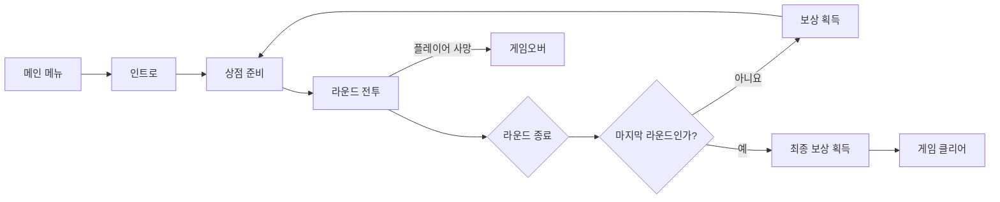
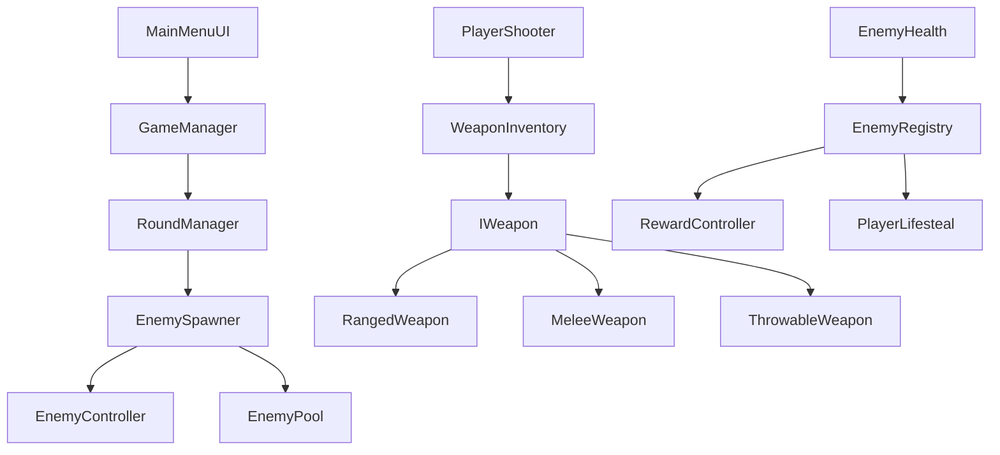

# Last City — 1인칭 라운드제 서바이벌 슈팅

> 제한된 시간 동안 적을 상대하고, 획득한 재화로 무기와 능력을 강화하며 다음 라운드에 도전하는 게임입니다.
> 개인 프로젝트 · 게임 로직 및 시스템 구현

## 게임 소개

| 항목 | 내용 |
| --- | --- |
| 장르 | 1인칭 라운드제 서바이벌 슈팅 |
| 목표 | 적의 공격에서 생존하며 모든 라운드를 완료합니다. |
| 핵심 재미 | 전투로 재화를 얻고 무기와 능력을 강화해 다음 라운드에 대응합니다. |

## 게임 플로우

`메인 메뉴 → 인트로 → 상점 준비 → 라운드 전투 → 보상 획득 → 상점 성장 → 다음 라운드 또는 게임 종료`

| 단계 | 동작 |
| --- | --- |
| 메인 메뉴 | 게임 시작 또는 설정 변경 |
| 인트로 | 플레이어를 시작 위치에 배치하고 게임 시작을 안내 |
| 상점 준비 | 전투 전 무기 구매와 능력 강화 |
| 라운드 전투 | 웨이브 데이터에 따라 생성된 적과 전투 |
| 라운드 종료 | 제한 시간 종료 또는 생성 완료 후 생존 적이 없으면 종료 |
| 보상·성장 | 라운드 보상을 받고 다음 전투 준비 |
| 게임 종료 | 플레이어 사망 시 게임오버, 마지막 라운드 완료 시 클리어 |

## 플레이 미리보기

<!-- 핵심 전투와 상점 성장 흐름이 함께 보이는 GIF 또는 대표 이미지 삽입 예정 -->

## 프로젝트 정보

| 항목 | 내용 |
| --- | --- |
| 인원 | 1인 |
| 개발 범위 | 게임 흐름, 전투, 적, 라운드, 상점, 성장, 저장, UI 로직 |
| 환경 | Unity 6000.3.15f1 · C# · URP · New Input System · UniTask · AI Navigation |
| 저장소 | [GitHub 저장소](https://github.com/Devel-Rocket-ClassRoom/minigame-project-jeri2779) |

## 핵심 개발

- 게임 상태, 라운드 진행, 적 생성을 각각 분리하고 순서대로 명령을 전달하도록 구성했습니다.
- 총기·근접·투척 무기를 `IWeapon`으로 다루고, 무기 데이터와 실행 로직을 분리했습니다.
- 적 행동을 상태 흐름으로 구분하고 NavMesh 추적, 웨이브 구성, 적·투사체·VFX 재사용을 연결했습니다.

## 구현 확인표

| 구현 | 대표 코드 | 영상 |
| --- | --- | --- |
| 게임·라운드 흐름 | [`GameManager.cs`](Assets/Scripts/Manager/GameManager.cs), [`RoundManager.cs`](Assets/Scripts/Manager/RoundManager.cs) | 추가 예정 |
| 무기 공통 구조 | [`IWeapon.cs`](Assets/Scripts/Weapons/IWeapon.cs), [`PlayerShooter.cs`](Assets/Scripts/Weapons/PlayerShooter.cs) | 추가 예정 |
| 피해 계산 | [`PlayerDamageCalculator.cs`](Assets/Scripts/Weapons/PlayerDamageCalculator.cs) | 추가 예정 |
| 적 행동·웨이브 | [`EnemyController.cs`](Assets/Scripts/Enemy/EnemyController.cs), [`WaveData.cs`](Assets/Scripts/SOD/WaveData.cs) | 추가 예정 |
| 적·투사체·VFX 재사용 | [`EnemyPool.cs`](Assets/Scripts/Enemy/EnemyPool.cs), [`ProjectilePool.cs`](Assets/Scripts/Enemy/ProjectilePool.cs), [`VfxPool.cs`](Assets/Scripts/Enemy/VfxPool.cs) | 추가 예정 |
| 상점·성장 | [`ShopController.cs`](Assets/Scripts/Manager/ShopController.cs), [`UpgradeManager.cs`](Assets/Scripts/Manager/UpgradeManager.cs) | 추가 예정 |

## 핵심 구현

### 게임·라운드 흐름

| 구성 | 역할 |
| --- | --- |
| `GameManager` | 메인 메뉴, 인트로, 플레이, 게임오버, 클리어 상태 전환 |
| `RoundManager` | 라운드 시간, 상점 시간, 보상, 다음 라운드 진행 |
| `EnemySpawner` | 라운드에 맞는 적 구성과 생성 처리 |
| `RoundUIPresenter` | 라운드 이벤트를 받아 진행 정보 표시 |

- **책임 분리** = 게임 전체 상태와 라운드 내부 진행, 적 생성을 서로 다른 클래스가 담당합니다.
- **종료 판정** = 제한 시간이 끝나거나, 적 생성이 끝난 뒤 생존 적이 없을 때 라운드를 종료합니다.
- **이벤트 전달** = 라운드 변경과 클리어 결과를 이벤트로 전달하여 진행 로직이 UI를 직접 변경하지 않도록 구성했습니다.

### 무기와 피해 계산

| 구성 | 역할 |
| --- | --- |
| `PlayerShooter` | 발사·조준 입력과 현재 무기 사용 조율 |
| `WeaponInventory` | 주무기·보조무기·근접·투척 슬롯 관리 |
| `IWeapon` | 무기가 제공할 사용·갱신·재장전·취소 동작 정의 |
| 무기 구현체 | 총기, 근접, 투척 무기의 개별 행동 처리 |
| `WeaponData` | 피해량, 사거리, 가격, 외형 등 설정값 보관 |
| `PlayerDamageCalculator` | 공격 배율과 전투 조건을 반영한 피해 계산 |

- **공통 호출** = `PlayerShooter`는 현재 장착된 무기를 `IWeapon`으로 받아 같은 방법으로 사용합니다.
- **데이터 분리** = 무기 설정은 ScriptableObject에 보관하고, 탄약과 공격 행동은 무기 구현체가 처리합니다.
- **계산 집약** = 헤드샷, 치명타, 근접 배율과 플레이어·대상의 상태에 따른 피해 계산을 한곳에서 처리합니다.
- **종류별 효과** = 해금 상태에 따라 권총 처형, 샷건 거리 보너스, 돌격소총 관통, 기관단총 탄약 사용 방식이 달라집니다.

### 적 행동과 웨이브

| 구성 | 역할 |
| --- | --- |
| `EnemyController` | 추적·공격·준비·행동·회복 상태 진행 |
| `EnemyData` | 적 체력, 이동, 공격, 행동 종류 설정 |
| `WaveData` | 적 등장 시점과 라운드별 수량 설정 |
| `EnemySpawner` | 동시 생존 수를 확인하며 적을 묶음 단위로 생성 |
| `EnemyRegistry` | 생존 적과 처치 결과 관리 |

- **행동 구분** = 적 행동을 `enum`과 `switch` 기반 상태 흐름으로 나누고 일반·돌진·투척 행동을 처리합니다.
- **길찾기 갱신** = NavMesh 목적지를 매 프레임 지정하지 않고 설정된 간격마다 다시 계산합니다.
- **라운드 구성** = 기본 증가 규칙과 특정 라운드 덮어쓰기 데이터를 이용해 등장 적과 수량을 정합니다.
- **사망 전달** = 적 사망 결과를 `EnemyRegistry`에 전달하고 보상과 흡혈 기능이 해당 이벤트를 구독합니다.

### 반복 생성 대상 재사용

| 대상 | 처리 클래스 | 반환 전 초기화 |
| --- | --- | --- |
| 적 | `EnemyPool` | 행동 상태, 타이머, Animator, NavMeshAgent, 체력 |
| 적 투사체 | `ProjectilePool` | 투사체 진행 상태 |
| 폭발 VFX | `VfxPool` | 재생 상태 |

- **재사용 구조** = 전투 중 반복해서 필요한 적·투사체·VFX를 보관했다가 다시 활성화합니다.
- **스폰 초기화** = 재사용된 적이 이전 행동과 체력 상태를 이어받지 않도록 생성 시 상태를 초기화합니다.

### 상점과 성장

| 구성 | 역할 |
| --- | --- |
| `ShopController` | 구매 가능 여부 확인, 재화 차감, 구매 명령 처리 |
| `UpgradeManager` | 강화 레벨 보관과 캐릭터 능력치 적용 |
| `RewardController` | 적 처치와 라운드 완료에 따른 재화·점수 처리 |
| `ShopUI` | 상점 정보 표시와 사용자 입력 전달 |

- **구매 순서** = 구매 조건 확인 → 재화 차감 → 무기 장착 또는 능력 적용 순서로 처리합니다.
- **성장 항목** = 공격·체력과 이동, 스태미너, 재장전, 치명타, 흡혈 등 전투 관련 능력을 강화할 수 있습니다.
- **표시 분리** = 구매 판단은 `ShopController`, 화면 표시는 `ShopUI`가 담당합니다.

## 개발 범위

| 구분 | 내용 |
| --- | --- |
| 직접 개발 | `Assets/Scripts`의 게임 흐름·캐릭터·무기·적·상점·성장·저장·UI 코드 |
| 제공 코드 | Unity 프로젝트 기본 안내용 `TutorialInfo` 코드 |
| 외부 리소스 | 사용한 모델·애니메이션·UI·사운드는 출처 확인 후 별도 표기 예정 |

## 실행 및 영상

| 항목 | 내용 |
| --- | --- |
| 실행 환경 | Unity 6000.3.15f1 |
| 실행 장면 | `Assets/Scenes/MainScene.unity` |
| 실행 방법 | 프로젝트를 열고 `MainScene`을 실행 |
| 플레이 영상 | 추가 예정 |

### 조작 방법

| 입력 | 동작 |
| --- | --- |
| `WASD` | 이동 |
| 마우스 이동 | 시점 조작 |
| 마우스 왼쪽 | 공격 |
| 마우스 오른쪽 | 조준·근접 보조 공격 |
| `Space` | 점프 |
| `Left Shift` | 질주 |
| `R` | 재장전 |
| `1` `2` `3` `4` | 무기 슬롯 선택 |
| `B` | 상점 열기 |
